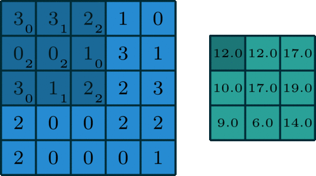
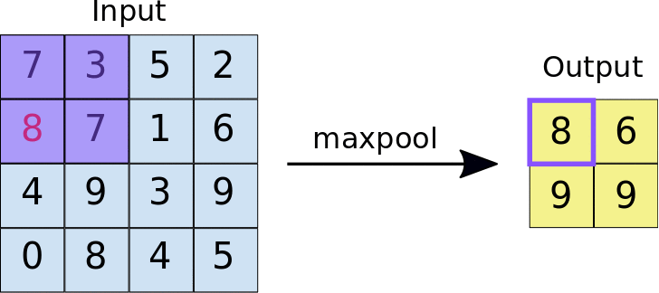

# 🧯 CNN Math Overview: Forward Pass Explained

This section breaks down the **forward pass** in our convolutional neural network built using only NumPy.

---

## 🚀 Forward Pass Overview

The forward pass follows this sequence:

```
Input (28x28 Image)
  ↓
Convolution Layer (3x3 filters)
  ↓
ReLU Activation
  ↓
Max Pooling (2x2)
  ↓
Flatten
  ↓
Fully Connected Layer (Dense)
  ↓
Softmax Output
```

Each layer progressively transforms the input to make it more suitable for classification.

---

## 🛠️ Convolution Operation

### What is Convolution?
Convolution applies **learnable filters** (kernels) over the input image to detect patterns like edges, curves, or textures. Each filter slides (convolves) across the image, performing element-wise multiplication and summing the result.

### Why is it Needed?
- Extracts **local features** from the input  
- Preserves **spatial relationships**  
- Reduces the number of parameters compared to fully connected layers

### How is it Calculated?
For an input region and filter:

```
Z = X_region * W + b
```

Where:
- `X_region` is a slice of the input
- `W` is the filter
- `b` is the bias

Each convolution operation produces a **feature map**.

### Visual Explanation:


---

## ⚡ ReLU Activation

### What is ReLU?
ReLU stands for **Rectified Linear Unit**. It's a simple nonlinear activation function:

```
A = max(0, Z)
```

### Why is it Needed?
- Adds **non-linearity** to the model  
- Helps prevent vanishing gradients  
- Speeds up training

---

## 🔲 Max Pooling

### What is Max Pooling?
Max pooling reduces the spatial dimensions of feature maps by selecting the maximum value in non-overlapping regions (usually 2x2).

### Why is it Needed?
- **Reduces computation**  
- Adds **translation invariance**  
- Controls overfitting

### How is it Calculated?
For each 2x2 region:

```
P[i,j] = max(X[i:i+2, j:j+2])
```

### Visual Explanation:


---

## 📦 Flatten

### What is Flattening?
Flattening reshapes the 3D output of max pooling into a 1D vector so it can be fed into a fully connected (dense) layer.

### Why is it Needed?
Dense layers expect 1D input.

---

## 🧠 Fully Connected Layer (Dense)

### What is it?
The dense layer connects every input feature to every output class.

### How is it Calculated?
```
Z2 = F · W2 + b2
```

Where:
- `F` is the flattened input
- `W2` are the weights
- `b2` are the biases

---

## 🌐 Softmax Output

### What is Softmax?
Softmax converts raw scores (logits) into probabilities:

```
A2[i] = exp(Z2[i]) / Σ_j exp(Z2[j])
```

### Why is it Needed?
- Outputs probabilities that sum to 1  
- Useful for **multi-class classification**

---

# 🔁 CNN Math Overview: Backward Pass (Backpropagation)

Once we compute the prediction from the forward pass, we need to **update our weights** to minimize the loss. This is done using **backpropagation**, which calculates gradients for each layer using the **chain rule**.

---

## 🔂 Backward Pass Flow

```
Loss
  ↓
Softmax + Cross Entropy
  ↓
Dense Layer → dW2, db2
  ↓
Flatten
  ↓
Max Pooling → grad passed through max indices
  ↓
ReLU → gradient blocked for Z <= 0
  ↓
Convolution Layer → dW1, db1
```

---

## 🔗 Chain Rule Intuition

Each layer's gradient is computed as:

```
dL/dX = dL/dZ × dZ/dX
```

Where `dL` is the loss and `X` is the input to a function.

---

## 🎯 Step-by-Step Gradients

### 1. 🎯 Softmax + Cross Entropy

We use:
```
dZ2 = A2 - y
```

- `A2` is the softmax output
- `y` is the true one-hot label
- This combines the softmax derivative and cross-entropy gradient

---

### 2. 🧠 Dense Layer Gradient (W2, b2)

Given:
```
Z2 = F · W2 + b2
```

We compute:
```
dW2 = F.T · dZ2
db2 = sum(dZ2)
dF  = dZ2 · W2.T
```

This gives us the gradients w.r.t. the dense layer parameters and its input.

---

### 3. 📦 Flatten Backward

Just reshape `dF` back to the shape of pooled output:
```
dP1 = dF.reshape(P1.shape)
```

---

### 4. 🔲 Max Pooling Backward

For each 2x2 region:
- The gradient is **assigned only to the max value's position**
- All other values get zero gradient

We locate the max position used during forward pass and pass `dout` back only there.

---

### 5. ⚡ ReLU Backward

```
dZ1 = dA1 × (Z1 > 0)
```

The derivative of ReLU is:
- 1 if `Z > 0`
- 0 if `Z <= 0`

---

### 6. 🛠️ Convolution Backward (W1, b1)

This is the most complex step.

We slide the upstream gradient `dZ1` over the input and compute:

```
dW1[f] += dZ1[i, f, h, w] × X_region
db1[f] += dZ1[i, f, h, w]
```

For the input gradient (`dX`), we "slide back" the filter over the gradient:

```
dX_region += dZ1[i, f, h, w] × W1[f]
```

### Final Gradients from Conv Layer:
- `dW1`: Gradient of filters
- `db1`: Gradient of biases
- `dX`: Gradient passed to the previous input (unused here)

---

## 🔄 Summary of Gradient Flow:

```
Loss → dZ2 → dW2, db2
              ↓
          dF (flattened)
              ↓
         dP1 (reshape)
              ↓
       MaxPool → dA1
              ↓
        ReLU  → dZ1
              ↓
        Conv  → dW1, db1
```

---

## 🧠 Optimizer Step

Finally, parameters are updated using:

```
W -= learning_rate × dW
```

This applies to both convolution and dense layer parameters.

---


